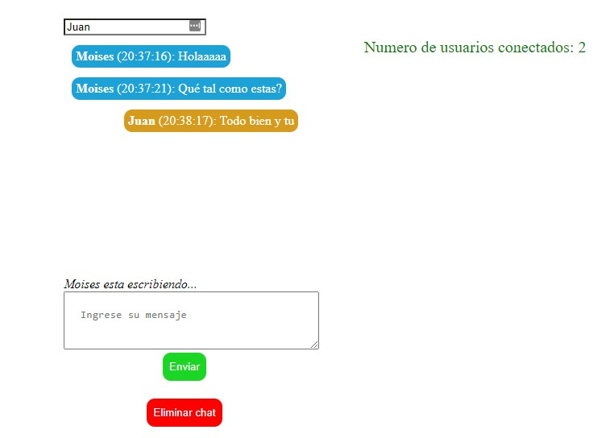

# Chat en tiempo real - Con Node.js
Es un chat en tiempo real hecho con Node.js haciendo el uso de sockets para permitir la comunicación en tiempo real. 
Hace falta mejorar la parte gráfica, ya que, el proyecto fue hecho principalmente para aprender mejor el concepto de los sockets.
Se pueden agregar funcionalidades extras como un login, limitar el chat para que los mensajes sean privados entre dos personas, etc.

## Overview

### Screenshot

### Tecnologías utilizadas

- HTML
- CSS 
- JavaScript
- Node

## Author

- GitHub - [moises35](https://github.com/moises35)